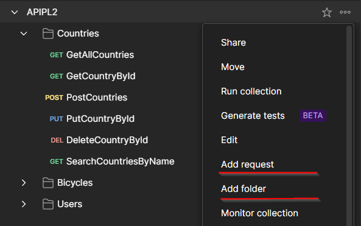

 <p align="center"></p>

# Laravel Docs

# API
An API will make the connection between the database and the information that's gonna be sent to the user.
<hr>

## Topics

  - [Model](#model)
  - [Route](#route)
  - [Controller](#controller)
    - [index](#index)
    - [show](#show)
    - [store](#store)
    - [update](#update)
    - [destroy](#destroy)
    - [search](#search)
  - [POSTMAN](#postman)
  - [Requests](#requests)
    - [GET all users](#get-all-users)
    - [GET user by id](#get-user-by-id)
    - [ADD new user](#add-new-user)
    - [EDIT user](#edit-user)
    - [DELETE user](#delete-user)
    - [SEARCH user](#search-user)
  - [EXPORT API](#export-api)

<hr>

To create an API we need to have a controller like UserController that will handle the requests and responses. 

Before we work on the controller we need to tell the model which properties we want to be fillable and to create a route that will handle the requests.

## Model
To tell the model the properties that we want to be fillable we need the following code:
```php
protected $fillable = [
    'first_name',
    'last_name',
    'birth_date',
    'country_id'
];
```

## Routes
> File: `routes/api.php`
```php
Route::apiResource('users', 'UserController');
```
This will add all the routes that we need for the API. If we create a new function inside the controller we need to add the route manually like this:
```php
Route::get('users/search', 'UserController@search');
Route::apiResource('users', 'UserController');
```
This new route MUST be added before the `apiResource` route.

## Controller
> File: `app/Http/Controllers/UserController.php`

### index
```php
public function index()
{
    return response()->json(User::all(), 200);
}
```
> response()->json() : retrieves the HHTP response in JSON <br>
> User::all() : Retrieves all records from the User model or table <br>
> HTTP status code: 200 stands for "OK" <br>

### show
```php
public function show($user)
{
    return response()->json($user, 200);
}
```
You can also use try-catch to validate if the user exists:
```php
public function show(User $user)
{
    try{
        return response()->json($user, 200);
    }
    catch(\Exception $e){
        return response()->json([
            'message' => 'User not found'
        ], 404);
    }
}
```

> - Accepts a User model instance as a parameter, representing the user to be retrieved. <br>
> - Attempts to return a JSON response with the user details and a status code of 200 (OK). <br>
> - If the user is not found, catches an exception (possibly a model not found exception) and responds with a JSON message indicating that the user was not found, along with a status code of 404 (Not Found).


### store
```php
public function store(Request $request)
{
    $user = User::create($request->all());
    return response()->json($user, 201);
}
```
> - Accepts a request containing user data ($request). <br>
> - Creates a new user in the database using User::create(). <br>
> - Returns a JSON response with the newly created user data. <br>
> - Sets the HTTP status code to 201 (Created) to indicate successful resource creation.

### update
```php
public function update(Request $request, User $user)
{
    $user->update($request->all());
    return response()->json($user, 200);
}
```

### destroy
```php
public function destroy(User $user)
{
    $user->delete();
    return response()->json(null, 204);
}
```
> - Accepts a User model instance as a parameter, representing the user to be deleted. <br>
> - Deletes the specified user from the database using the delete method. <br>
> - Returns a JSON response with a null body. <br>
> - Sets the HTTP status code to 204 (No Content) to indicate successful resource deletion.

### search
```php
public function search(Request $request)
{
    return response()->json(User::orderBy("first_name", "desc")->where('first_name', 'LIKE', '%' . $request->first_name . '%')->get(), 200);
}
```
> - Accepts a Request object, likely containing search parameters. <br>
> - Retrieves a collection of users from the database using the User model. <br>
> - Orders the results by the "first_name" column in descending order (desc). <br>
> - Filters the results based on a partial match of the "first_name" column with the provided search term.
Returns a JSON response with the matching users and a status code of 200 (OK).

## POSTMAN
To test the API we can use POSTMAN. We can send requests to the API and see the responses.

First we need to create a new collection. We can then add a 'User' folder inside the collection.

Now we can add the requests according to the methods we added inside the controller.



## Requests

## GET:

#### Purpose: Retrieve resource(s).

#### Usage:
- GET link/api/users: Retrieve a list of all users.
- GET link/api/users/{id}: Retrieve details of a specific user.
- GET link/api/users/search?first_name=John: Search for users with the first name "John."

## POST:

#### Purpose: Create a new resource.
#### Usage:
- POST link/api/users: Create a new user using the provided data in the request body.

`Body -> Raw -> JSON`
```json
{
    "first_name": "John",
    "last_name": "Doe",
    "birth_date": "1990-01-01",
    "country_id": 1
}
```

## PUT/PATCH:

#### Purpose: Update an existing resource.
#### Usage:
- PUT link/api/users/{id} or PATCH /users/{id}: Update the details of a specific user using the data provided in the request body.

`Body -> Raw -> JSON`
```json
{
    "name": "justaddeditlolez",
    "created_at": "2023-10-03T20:27:07.000000Z",
    "updated_at": "2023-10-03T20:27:07.000000Z",
    "deleted_at": null
}
```

## DELETE:

#### Purpose: Delete an existing resource.
#### Usage:
- DELETE link/api/users/{id}: Delete the specified user.


## SEARCH:

#### Purpose: Retrieve resources based on specific criteria.
#### Usage:
GET link/api/users/search?first_name=John: Search for users with the first name "John." This is often a custom search endpoint.


**WARNING**

This will only work for `first_name` parameter since we only added that parameter inside the controller. If we want to search by other parameters we need to add them inside the controller.

# Additional Notes:
The use of PUT versus PATCH depends on whether you are replacing the entire resource (PUT) or updating only specific fields (PATCH).

For search functionality, it's common to use the GET method with query parameters to filter and search for specific resources.

The naming conventions (`index`, `show`, `store`, `update`, `destroy`, `search`) are following RESTful conventions and align with Laravel's resourceful controllers.

## EXPORT API
In the end we can export the collection to a JSON file.
---
[TOP](#api)

[BACK](./)
