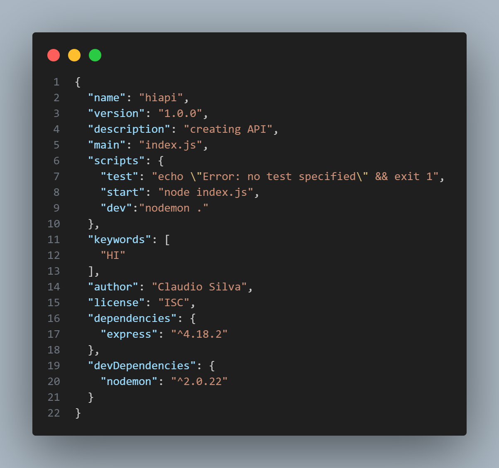

# Node JS / Vite

<a href="https://cdn.freebiesupply.com/logos/large/2x/nodejs-1-logo-png-transparent.png">
  <picture>
    <source media="(prefers-color-scheme: dark)" srcset="https://cdn.freebiesupply.com/logos/large/2x/nodejs-1-logo-png-transparent.png" />
    
  </picture>&nbsp;&nbsp; 
  <picture>
    <source media="(prefers-color-scheme: dark)" srcset="https://vitejs.dev/logo-with-shadow.png" />
    
  </picture>
</a> &nbsp;&nbsp; 
<a href="https://github.com/nvm-sh/logos">
  <picture>
    <source media="(prefers-color-scheme: dark)" srcset="https://raw.githubusercontent.com/nvm-sh/logos/HEAD/nvm-logo-white.svg" />
    
  </picture>
</a>&nbsp; &nbsp; 
<a href="https://andrejgajdos.com/wp-content/uploads/2019/11/npm-logo.png?x24361">
  <picture>
    <source media="(prefers-color-scheme: dark)" srcset="https://andrejgajdos.com/wp-content/uploads/2019/11/npm-logo.png?x24361" />
    
  </picture>
</a>

<br>

- 💡 Instant Server Start
- ⚡️ Lightning Fast HMR
- 🛠️ Rich Features
- 📦 Optimized Build
- 🔩 Universal Plugin Interface
- 🔑 Fully Typed APIs

>Next Generation Frontend Tooling

<br>

# Installation Links


### NVM Install: [Github](https://github.com/nvm-sh/nvm)

### Node Install: [Node 16.19.1](https://nodejs.org/download/release/v16.19.1/node-v16.19.1-x64.msi)

### Node Documentation: [Docs](https://nodejs.org/docs/latest-v18.x/api/)

---
## NPM Commands

```shell
npm help
```  
> See all npm commands


```shell
npm install module_name
```  
> Install a dependence, you can also use npm i module_name

```shell
npm install module_name -D
```  
> Install a Development dependence

```shell
npm unninstall module_name
```  
> Remove dependence

```shell
npm update
```  
> Update modules

```shell
npm audit
```  
> Identifies and reports security vulnerabilities in project dependencies.

```shell
npm run script
```  
> Executes a custom command or task defined in `package.json` scripts.


---

## NVM Commands


```shell
nvm help
```  
> See all nvm commands

```shell
nvm install
```  
> Download and install a Node.js version `nvm install 16`

```shell
nvm unninstall
```  
> Unninstall a Node.js version `nvm unninstall 16`

```shell
nvm use
```  
> Use a specific Node.js version `nvm use 16`

```shell
nvm ls
```  
> List installed Node.js versions

```shell
nvm -v
```  
> Display nvm's version
                   
---

## Vite Commands ⚡

```shell
npm create vite@latest
```  
> Start Vite with NPM

---

## ES Native Modules vs CommonsJS


### CommonJS

#### <u>Export</u>
`const name = "Claudio";`
```javascript
module.exports = {name};
```  
> Exporting object `name` so it can be imported afterwards

`exporting from greeting.js`

#### <u>Import</u>
```javascript
const nome = require("./greeting");
```  
> Importing object `name` to a variable `nome`;

### ES Native
*on `package.json`*
*add `"type" : "module",`*
#### <u>Export</u>
```javascript
exports const name = "Claudio";
```
###### or
```javascript
exports(name);
```  
> Exporting object `name` so it can be imported afterwards

`exporting from greeting.js`

#### <u>Import</u>
```javascript
import { name } from "./greeting";
```  
> Importing object `name`
---

## Create Node Project

```javascript
Npm init –y
```  
> -y creates a project with default settings, you can check it on
`package.json`



 ### Import Express
`main.js`

```javascript
import { express } from 'export';
``` 

```javascript
const app = express();
``` 
 ### Create Route
 `main.js`

```javascript
app.get('/', (reg,res) => {
  res.send('Hi');
});
``` 
>Request handler to '/' `receives a request and sends out a Hi`

## Create Vite Project

```shell
npm create vite@latest
```  
> Creates the Vite project

